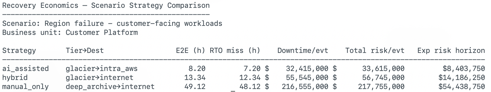

# Recovery Economics

Recovery Economics is a decision tool for stress‑testing cloud backup and recovery choices.

It focuses on a part of cloud cost optimization that is usually hand‑waved or oversimplified:
**what actually happens when you need your data back**.

Instead of stopping at “this storage tier is cheaper,” Recovery Economics helps answer questions like:

- How long will recovery actually take in a real incident?
- Does that fit within the RTO we’ve committed to?
- How much value is at risk if we miss it?
- How do detection delays change the economics?
- Over a planning horizon, are storage savings worth the recovery risk?

The output is deterministic, auditable, and intentionally opinionated.
All assumptions are explicit and visible.

---

## Why this exists

Cold storage is often treated as a simple win:
move data to cheaper tiers, lower the monthly bill, move on.

But recovery is where those decisions get tested.

During a real incident:

- retrieval fees appear
- egress costs matter
- bandwidth and efficiency stop being theoretical
- detection delays compound recovery time
- downtime cost dominates storage savings
- regulatory and reputational risk show up in the same hour as the outage

Recovery Economics frames cold storage as a **risk decision** that connects
storage choices to downtime, regulatory impact, and strategy design.

---

## What it does

Recovery Economics models the economics of restoring data from AWS cold storage tiers
for two main workflows:

1. **Direct restore stress test**:  
   Answer “what happens if we pull _this_ many GB from _this_ tier under _these_ conditions?”
2. **Scenario‑driven strategy comparison**:  
   Model a full business scenario in YAML and compare AI‑assisted runbooks vs hybrid vs fully manual recovery.

### 1. Direct restore stress test

Given a storage tier, size, and network assumptions, Recovery Economics estimates:

- thaw time
- transfer time
- total restore time
- restore‑only RTO hit/miss
- retrieval and egress costs

Example:

```bash
recovery-economics \
  --tier glacier \
  --size-gb 2000 \
  --destination intra_aws \
  --bandwidth-mbps 2000 \
  --efficiency 0.85 \
  --rto-hours 4
```

This prints a short, human‑readable breakdown of restore time and cost.
To integrate with other tools, add `--json`:

```bash
recovery-economics \
  --tier glacier \
  --size-gb 2000 \
  --destination intra_aws \
  --bandwidth-mbps 2000 \
  --efficiency 0.85 \
  --rto-hours 4 \
  --json
```

Example JSON (truncated):

```json
{
  "inputs": {
    "tier": "glacier",
    "size_gb": 2000.0,
    "destination": "intra_aws",
    "bandwidth_mbps": 2000.0,
    "efficiency": 0.85,
    "rto_hours": 4.0
  },
  "result": {
    "thaw_time_hours": 4.0,
    "transfer_time_hours": 2.61,
    "total_time_hours": 6.61,
    "retrieval_cost_usd": 20.0,
    "egress_cost_usd": 0.0,
    "total_cost_usd": 20.0
  }
}
```

### 2. Scenario‑driven strategy comparison

The more interesting mode is **scenario files**.

A scenario describes:

- the business context
- RTO / RPO commitments
- downtime economics
- regulatory penalty exposure
- one or more strategies (AI‑assisted, hybrid, manual)

Each strategy points at a specific restore profile (tier, destination, size, bandwidth, efficiency).
The CLI then computes:

- end‑to‑end downtime (including detection delay)
- RTO miss in hours
- per‑event downtime loss
- expected regulatory penalty per event
- expected loss over a planning horizon
- side‑by‑side strategy comparison

---

## Example: ransomware – fast recovery

This repository includes a worked example at:

```text
scenarios/ransomware_fast_recovery.yml
```

Conceptually, it models:

- a critical payments workload
- 60‑minute RTO and 15‑minute RPO
- high downtime cost per minute
- a non‑zero chance of regulatory penalty

with three strategies:

- `ai_assisted`: AI‑assisted runbook, pre‑validated automation, human approval on high‑risk steps.
- `hybrid`: AI suggestions, manual execution for most steps.
- `manual_only`: traditional, ticket‑driven coordination across teams.

Run a single strategy:

```bash
recovery-economics \
  --scenario-file scenarios/ransomware_fast_recovery.yml \
  --strategy ai_assisted
```

Example output (abbreviated):

```text
Recovery Economics — Scenario Mode
----------------------------------
Loaded scenario: Ransomware – fast recovery
Business unit: Core Payments

Strategy: ai_assisted
Tier: glacier → intra_aws
Total restore time: 6.61h
End-to-end downtime: 6.94h
RTO: 1.00h
RTO miss: 5.94h
Estimated downtime loss (per event): $7,132,000.00
Expected regulatory penalty (per event): $600,000.00
Total modeled risk (per event): $7,732,000.00
Expected total risk over 5.0 years at 0.20 incidents/year: $7,732,000.00
```

Compare all strategies:

```bash
recovery-economics \
  --scenario-file scenarios/ransomware_fast_recovery.yml \
  --compare-strategies
```

Example comparison table:

```text
Recovery Economics — Scenario Strategy Comparison
-------------------------------------------------
Scenario: Ransomware – fast recovery
Business unit: Core Payments

Strategy       Tier→Dest                 E2E (h) RTO miss (h)    Downtime/evt    Total risk/evt   Exp risk horizon
------------------------------------------------------------------------------------------------------------------
ai_assisted    glacier→intra_aws            6.94         5.94 $     7,132,000 $       7,732,000         $7,732,000
manual_only    deep_archive→internet       27.14        26.14 $    31,372,000 $      31,972,000        $31,972,000
hybrid         glacier→internet            10.68         9.68 $    11,620,000 $      12,220,000        $12,220,000
```

If you prefer JSON, add `--json`:

```bash
recovery-economics \
  --scenario-file scenarios/ransomware_fast_recovery.yml \
  --compare-strategies \
  --json
```

You’ll get one JSON document per strategy, suitable for piping into a dashboard or notebook.

---

## Scenario file structure

Scenario files are plain YAML.

At a high level:

- `id`, `name`, `business_unit` describe the scenario.
- `parameters` define RTO/RPO, downtime cost, detection delay, regulatory risk, and horizon.
- `strategies` define the restore profile for each strategy.

Example (simplified):

```yaml
id: ransomware_fast_recovery
name: "Ransomware – fast recovery"
business_unit: "Core Payments"

parameters:
  rto_minutes: 60
  rpo_minutes: 15
  cost_per_minute_outage: 20000
  detection_delay_minutes: 20
  regulatory_penalty_probability: 0.3
  regulatory_penalty_amount: 2000000
  discount_rate_annual: 0.08
  incident_frequency_per_year: 0.2
  planning_horizon_years: 5

strategies:
  ai_assisted:
    description: "AI-assisted runbook with pre-validated automation and human approval on high-risk steps."
    restore:
      tier: glacier
      destination: intra_aws
      size_gb: 2000
      bandwidth_mbps: 2000
      efficiency: 0.85

  manual_only:
    description: "Traditional manual runbook with human coordination across teams."
    restore:
      tier: deep_archive
      destination: internet
      size_gb: 2000
      bandwidth_mbps: 500
      efficiency: 0.60
```

The CLI converts this into hours, dollars, and risk metrics.

---

## Included scenarios

This repo ships with a small scenario library to showcase different failure modes:

- `ransomware_fast_recovery.yml`  
  Critical payments workload with tight RTO, contrasting AI‑assisted vs manual recovery.

- `ransomware_delayed_detection.yml`  
  Similar to the fast‑recovery case, but with slower detection and heavier emphasis on detection lag.

- `accidental_delete_production.yml`  
  Production data loss with no regulatory penalty but real downtime cost and RPO sensitivity.

- `region_outage_analytics.yml`  
  Region‑level event for analytics workloads with lower cost per minute but large data volumes.

- `compliance_audit_restore.yml`  
  Large regulatory archive restores where the main risk is audit delay and penalties, not customer‑visible downtime.

- `test_restore_quarterly.yml`  
  Regular disaster recovery testing program, modeling the cost of consistently exercising restores.

- `region_failure_customer_facing.yml`  
  Customer‑facing regional failure with large volumes, meaningful regulatory risk, and sharp RTO targets.

Each scenario is a starting point. Copy, rename, and adjust the YAML to reflect your own workloads, tiers, and economics.

---

## AI decision narrative (optional)

For a single strategy run, you can ask Recovery Economics to print a short narrative summary:

```bash
recovery-economics \
  --scenario-file scenarios/ransomware_fast_recovery.yml \
  --strategy ai_assisted \
  --ai-narrative
```

If an OpenAI API key is available in `OPENAI_API_KEY`, the tool will:

- describe the strategy in plain language
- call out RTO miss vs target
- summarize downtime and penalty risk

If the API key or client is missing, the rest of the CLI continues to work without AI output.

---

## Screenshots

If you prefer to show the tool in action in your own docs or slideware:

1. Run one or more of the examples above in your terminal.
2. On macOS, use `⌘ + Shift + 4` to capture a selection of the terminal window.
3. Save the PNGs into the repo, for example:

   ```text
   artifacts/ransomware_fast_recovery_compare.png
   artifacts/region_failure_customer_facing_compare.png
   ```

4. Reference them in Markdown:

   ```markdown
   

   
   ```

These screenshots pair nicely with the scenario YAML and the comparison tables above.

---

## Who this is for

- FinOps practitioners who want recovery to show up in cost conversations
- Cloud cost and infrastructure engineers
- SRE and reliability teams running DR tests and chaos experiments
- Anyone translating between finance, engineering, and operational risk

Recovery Economics is intentionally focused.
It favors clear, repeatable decision framing over dashboards
and keeps the model small enough that you can read and reason about it.

It pairs naturally with tools like **FinOps Lite** and **FinOps Watchdog** as the **recovery decision layer**.

---

## Next update will include

Planned directions for the next version:

- A **scenario builder** that makes it easier to define and validate new YAML scenarios from a standard template.
- Optional **dependency‑graph support** for multi‑step runbooks and critical‑path recovery (multiple restores, cutovers, and validation steps).
- Experimental **probabilistic inputs** (ranges and percentiles) layered on top of the deterministic core, for teams that want to explore tail risk.
- Better hooks for **integration with FinOps Lite and FinOps Watchdog**, so recovery risk can be surfaced alongside spend changes and guardrail alerts.

The current version focuses on getting the core economics right, in a form that can be read, audited, and extended by your own team.
