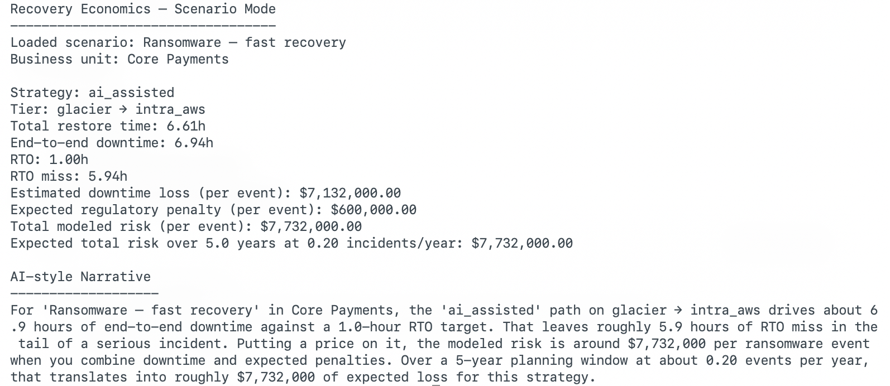

# Recovery Economics

Recovery Economics is a decision tool for stress testing cloud backup and recovery choices.

It focuses on a part of cloud cost optimization that is often hand-waved or oversimplified:
**what actually happens when you need your data back**.

Instead of stopping at “this storage tier is cheaper,” Recovery Economics helps answer questions like:

- How long will recovery actually take in a real incident?
- Does that fit within the RTO we’ve committed to?
- How much value is at risk if we miss it?
- How do detection delays change the economics?
- Over a planning horizon, are storage savings actually worth the recovery risk?

The output is deterministic, auditable, and intentionally opinionated.
All assumptions are explicit and visible.

---

## Why this exists

Cold storage is often treated as a simple win:
move data to cheaper tiers, lower the monthly bill, move on.

But recovery is where those decisions get tested.

During a real incident:

- retrieval fees appear
- egress costs matter
- bandwidth and efficiency stop being theoretical
- detection delays compound recovery time
- downtime cost dominates storage savings
- regulatory and reputational risk show up in the same hour as the outage

Recovery Economics frames cold storage as a **risk decision**, connecting storage choices
directly to downtime, regulatory impact, and recovery strategy design.

---

## What it does

Recovery Economics models the economics of restoring data from AWS cold storage tiers
across two complementary workflows:

1. **Direct restore stress testing**
2. **Scenario-driven recovery strategy comparison**

### 1. Direct restore stress test

Given a storage tier, data size, and network assumptions, Recovery Economics estimates:

- thaw time
- transfer time
- total restore time
- restore-only RTO hit or miss
- retrieval and egress costs

Example:

```bash
recovery-economics   --tier glacier   --size-gb 2000   --destination intra_aws   --bandwidth-mbps 2000   --efficiency 0.85   --rto-hours 4
```

To integrate with other tools, add `--json` for machine-readable output.

---

### 2. Scenario-driven strategy comparison

The more powerful mode is **scenario files**.

A scenario captures:

- business context
- RTO / RPO commitments
- downtime economics
- detection delays
- regulatory penalty exposure
- one or more recovery strategies

Each strategy defines a restore profile (tier, destination, size, bandwidth, efficiency).
The CLI computes:

- end-to-end downtime
- RTO miss (hours)
- downtime loss per event
- expected regulatory penalty
- total modeled risk per event
- expected loss over a planning horizon
- side-by-side strategy comparisons

---

## Example: ransomware – fast recovery

This repository includes a worked scenario:

```text
scenarios/ransomware_fast_recovery.yml
```

It models:

- a critical payments workload
- tight RTO and RPO commitments
- high downtime cost
- non-zero regulatory exposure

with three strategies:

- **ai_assisted**: AI-assisted runbook with pre-validated automation and human approval on high-risk steps.
- **hybrid**: AI suggestions with manual execution.
- **manual_only**: fully manual, ticket-driven coordination.

Run a single strategy:

```bash
recovery-economics   --scenario-file scenarios/ransomware_fast_recovery.yml   --strategy ai_assisted
```

### Screenshot: single-strategy analysis



---

### Strategy comparison

Compare all strategies side by side:

```bash
recovery-economics   --scenario-file scenarios/ransomware_fast_recovery.yml   --compare-strategies
```

### Screenshot: ransomware strategy comparison


This view makes the tradeoffs explicit:
small monthly storage savings can concentrate millions of dollars of risk during recovery.

---

## Additional scenario: region failure (customer-facing)

Recovery Economics supports multiple scenario classes.

Example:

```text
scenarios/region_failure_customer_facing.yml
```

This scenario models:

- customer-facing regional outage
- large data volumes
- meaningful regulatory exposure
- aggressive RTO targets

### Screenshot: region failure comparison


---

## Scenario file structure

Scenario files are plain YAML.

At a high level:

- `id`, `name`, `business_unit` describe the scenario
- `parameters` define RTO/RPO, downtime cost, detection delay, regulatory risk, and horizon
- `strategies` define restore profiles per strategy

Simplified example:

```yaml
id: ransomware_fast_recovery
name: "Ransomware – fast recovery"
business_unit: "Core Payments"

parameters:
  rto_minutes: 60
  rpo_minutes: 15
  cost_per_minute_outage: 20000
  detection_delay_minutes: 20
  regulatory_penalty_probability: 0.3
  regulatory_penalty_amount: 2000000
  incident_frequency_per_year: 0.2
  planning_horizon_years: 5

strategies:
  ai_assisted:
    description: "AI-assisted runbook with pre-validated automation."
    restore:
      tier: glacier
      destination: intra_aws
      size_gb: 2000
      bandwidth_mbps: 2000
      efficiency: 0.85
```

---

## Included scenarios

This repo ships with a small scenario library covering common failure modes:

- `ransomware_fast_recovery.yml`
- `ransomware_delayed_detection.yml`
- `accidental_delete_production.yml`
- `region_outage_analytics.yml`
- `compliance_audit_restore.yml`
- `test_restore_quarterly.yml`
- `region_failure_customer_facing.yml`

Each scenario is meant to be copied and adapted to your own workloads.

---

## AI decision narrative (optional)

For a single strategy run:

```bash
recovery-economics   --scenario-file scenarios/ransomware_fast_recovery.yml   --strategy ai_assisted   --ai-narrative
```

The AI narrative explains already-computed results:
RTO miss, downtime exposure, and expected loss.
If no API key is present, the CLI still works without AI output.

---

## Who this is for

- FinOps practitioners who want recovery risk reflected in cost decisions
- Cloud cost and infrastructure engineers
- SRE and reliability teams running DR tests
- Anyone translating between finance, engineering, and operational risk

Recovery Economics favors clarity over coverage and judgment over dashboards.

It pairs naturally with **FinOps Lite** and **FinOps Watchdog** as the
**recovery decision layer** in a broader FinOps workflow.

---

## Next updates may include

Planned directions:

- A richer scenario authoring experience
- Optional dependency graphs for multi-step recovery paths
- Experimental probabilistic inputs layered on top of deterministic modeling
- Tighter integration with FinOps Lite and FinOps Watchdog

The current version focuses on getting the core economics right in a form that is
readable, auditable, and easy to extend.

